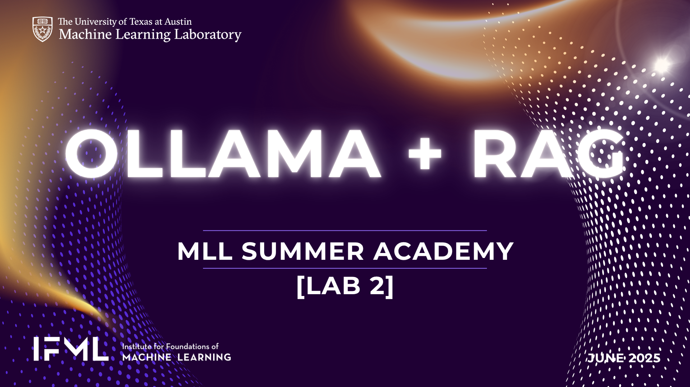

# Local RAG with Ollama




This is a fully local Retrieval-Augmented Generation (RAG) system using:

- Ollama (`llama3.1:latest` and `nomic-embed-text`) https://github.com/ollama/ollama
- ChromaDB for vector storage https://github.com/chroma-core/chroma
- PyMuPDF (`fitz`) for PDF parsing
- A terminal-based chat interface

## 🔧 Setup

> --- NOTE: While working in our lab - both steps 1 and 2 below have alredy been done for you. ---
> --- You should start with setup step #3 while running this in the UTCS Lab.

### 1. Install Dependencies

Use the following in your Conda environment:

```bash
pip install pymupdf chromadb tqdm termcolor langchain scikit-learn
```

> Important Note: w/in the classroom lab environment during camp, this has already been done for you.
> Don't install them to your local user as you'll run into permissions issues w/in the lab setup. 
> To access this cona environment run the `source /lusr ___________` command provided to you in class .

> If you're not in lab, and trying this on your own, you will need the dependencies listed above. Please refer
> the the `requirements.txt` file for the full list.
```bash
pip install -r requirements.txt
```

### 2. Install Ollama

- **Ubuntu**:
```bash
curl -fsSL https://ollama.com/install.sh | sh
```

- **macOS**:
```bash
brew install ollama
```
- **Windows**:
Download from https://ollama.com/download and install.

### 3. Then pull the required models:

```bash
ollama pull nomic-embed-text
ollama pull llama3.1:latest
```

You can check all the model files you have downloaded locall via ollama using: 
```bash
ollama list
```
Removing a model file is as easy as: 
```bash
ollama rm [model_name]
```

## 📂 Project Structure

```
rag_local_ollama/
├── GettingStarted/         # Lab guide we'll walk through in class
├── docs/                   # Place your PDFs here
├── test_and_qa-Scripts/    # Extra testing scripts used for build - you won't need these
├── ingested.json           # Tracks processed PDFs
├── pdf_loader.py           # PDF chunking logic
├── embedder.py             # Embedding via Ollama
├── retriever.py            # ChromaDB vector store + reranking
├── ollama_runner.py        # LLM prompt handling via Ollama
├── chat_loop.py            # Terminal input/output
├── pdf_manager.py          # Handles new PDF detection
├── rag_pipeline.py         # Main entrypoint
```

## 🚀 Run It

```bash
python rag_pipeline.py
```

Place any PDFs in the `docs/` directory. They’ll be automatically processed and embedded.
This RAG is updatable and supports multiple PDF's. 
- You can drop as many PDFs as you want into the docs/ folder.
- The `pdf_manager.py` script will only process the new ones by using `ingested.json` to remember what’s been done already.
- This ensure efficient use of embedding resources on your machine and only embedding new PDF's.

## ❓ Ask Questions

Ask a question in the terminal. Type `exit` or `bye` to quit.

---

This project is designed for use in Ubuntu, but works equally on macOS and Windows.
